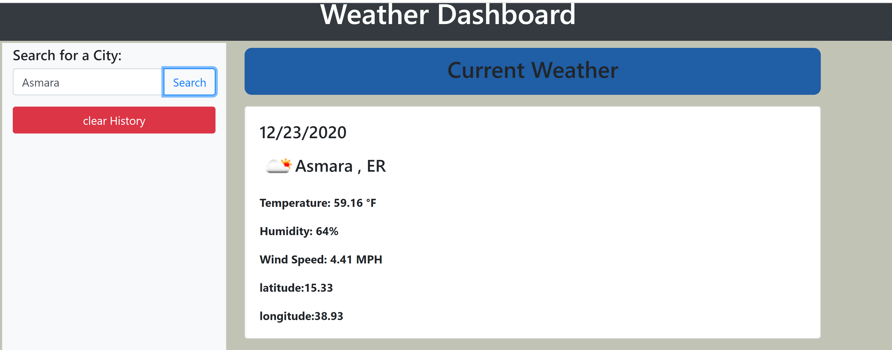
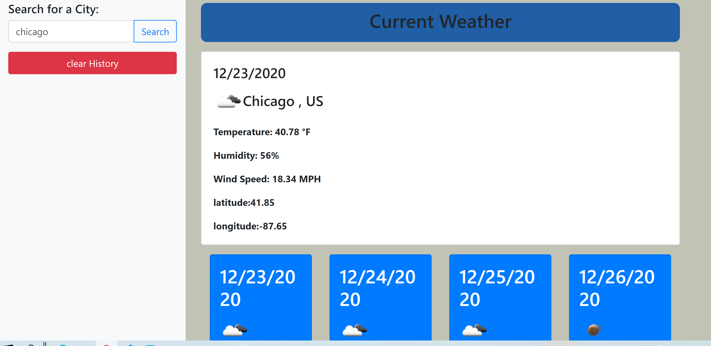

# -Weather-Dashboard
I am presented with current city and future conditions for that city and that city is added to the search history.I view current weather conditions for that city.THEN I am presented with the city name, the date, an icon representation of weather conditions, the temperature, the humidity, the wind speed, and the UV index.Then I am presented with a color that indicates whether the conditions are favorable, moderate, or severe.When I view future weather conditions for that city.
Then I am presented with a 5-day forecast that displays the date, an icon representation of weather conditions, the temperature, and the humidity.When I click on a city in the search history
Then I am again presented with current and future conditions for that city.When I open the weather dashboard.Then I am presented with the last searched city forecast.

URL https://negasimichael.github.io/-Weather-Dashboard/